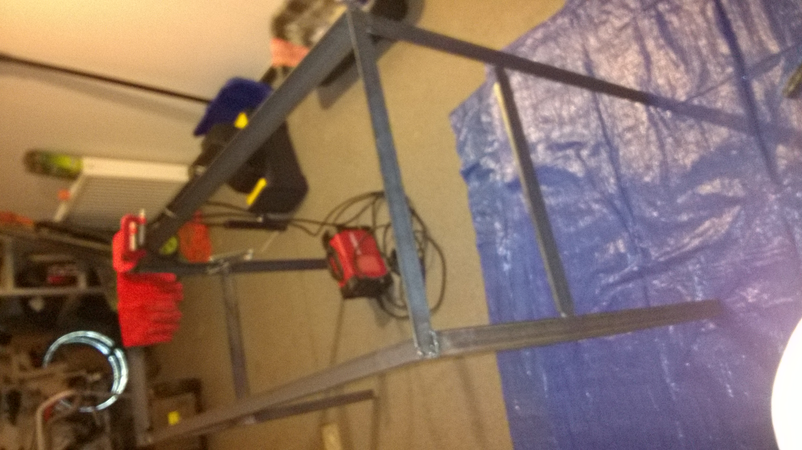
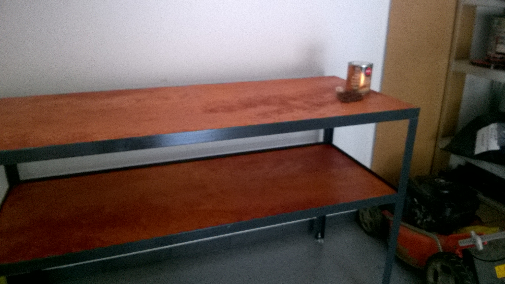

# Workshop Bench

This project is to make workshop bench using steel angles and arc welding -
MMA.Project assumes using steel angles 4 by 4 centimeters, 3 millimeters thick.

`Bench.blend` file is 3d model realized using Blender software. 

Screenshot:

Update. Bench is now *completed*. See photos:

I was learning how to do arc welding so here are my lessons learned:
- *Electrode 6012*. I think this electrode is suitable for beginners like
  myself. Arc generated by this electrode is soft and easy to launch and drive.
Even if you accidentally touch steel with electrode while welding it does not
stop. There are some flaws when using Electrode 6012 compared with 6013. Main
flaw is splash effect. Electrode tends to fire steel material and splash it
around which can make you get accidentally burned and also it leaves steel drops
around places where you weld. Second flaw comparing with 6013 is slag. Slag
generated by 6012 is not so easy to remove as slag generated by 6013.

- When welding try to use basic position as much as possible. In case of bench
  it is possible to manipulate it instead of modify welding position. For
beginners like myself it usually produce better effects than trying to adjust
welding positions.

- Blender software allows you to create models for projects like this one.
  Personally I like using it. Before any modeling work I strongly recommend to
go through tutorial like this one from [Blender
Guru](https://www.youtube.com/watch?v=JYj6e-72RDs&t=713s). Even if Blender is
not designed to be CAD tool I think it still meets basic requirements for
technical models like 3d print or simple bench like mine. Many thanks to
Blender Guru for great tutorial. 

