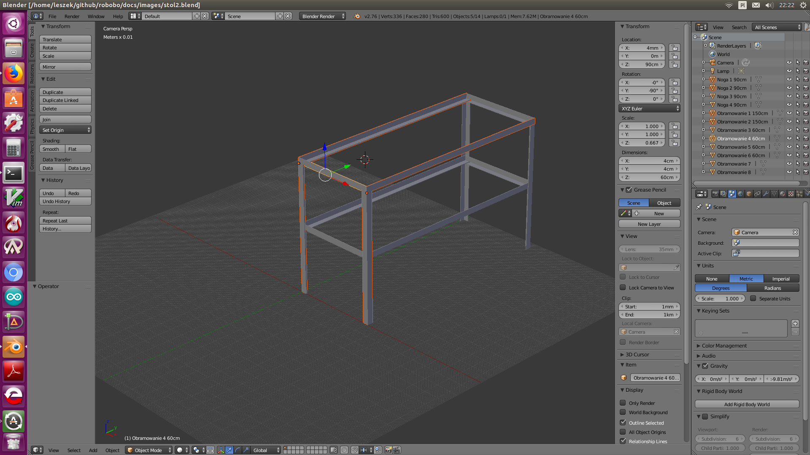

# bench

This project is to make bench using stell and arc welding - MMA. `Bench.blend` file is 3d model realized using Blender software. Project assumes using steel angles 4x4 cm and 3 millimeters thick.

